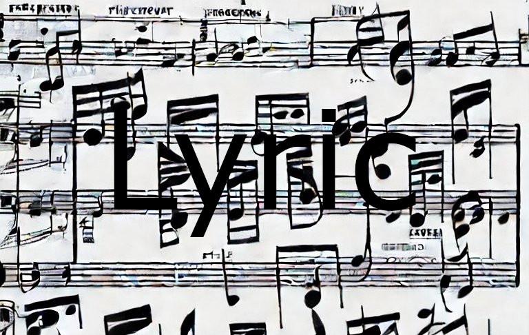

# lyric
                                         
This is an implementation of a natural language processing (NLP) algorithm that uses Drake lyrics as its training data. The purpose of this algorithm is to generate new, original lyrics that are in the style of Drake.

#### Data Collection
The training data for this algorithm consists of lyrics from Drake's songs, which were obtained through using the web scraping library Selenium. The data was pre-processed to remove any extraneous information and ensure that only the lyrics remained.

#### Model Architecture
Lyric is based on the deep learning architectureNetwork (RNN) or a Transformer. The model is trained on the collected lyrics data, learning to predict the next word in a given sequence of lyrics based on the context of the words that came before it.

#### Evaluation and Deployment
The performance of the algorithm can be evaluated using metrics such as accuracy and perplexity. Once the model has been trained and evaluated, it can be deployed for use by music artists and songwriters who are looking to generate new lyrics in the style of Drake. The algorithm can be run in real-time, providing users with instant results.

